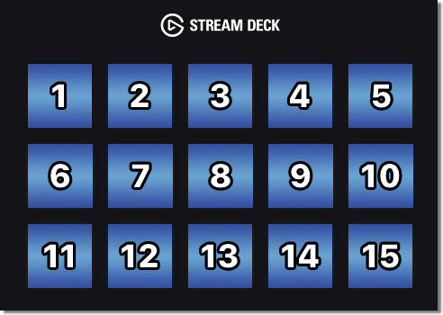

# Codedeck [](https://coveralls.io/github/Sherlouk/Codedeck?branch=master)

<p align="center">
  A Swift library for interfacing with an Elgato StreamDeck.
  <br /><br />
  
</p>

## Features

- Multiplatform Support (_See below_)
- Hotswapping and Multiple Connected Devices Support
- Set Device Brightness
- Fill Key with Solid RGB Colors
- More Soon!

#### Multiplatform Support

Swift is compatible with most modern systems and this project makes an effort to
keep dependencies light and not coupled to things like Cocoa/UIKit etc.

There are some extensions which, if Cocoa is available, adds extra functionality
but this does not limit what you're able to do rather just makes things simpler!

## Usage

#### Creating a `StreamDeck`

A `StreamDeck` currently requires a `HIDDevice` to be created. This is a thin
wrapper around the `IOHIDDevice` available in Apple's IOKit.

This library provides a device monitoring solution which informs of you when
certain devices are connected/disconnected from the system. This allows you to
hotswap StreamDeck devices as well as connect to multiple at once!

```swift
// 1. Create a device monitor and store a reference to it in your application
var monitor: HIDDeviceMonitor = {
    return HIDDeviceMonitor(streamDeckProducts: [ .streamDeck ])
}()

// 2. Create a delegate class within your application
extension SomeClass: HIDDeviceMonitorDelegate {

    func HIDDeviceAdded(device: HIDDevice) {
        // ...
    }

    func HIDDeviceRemoved(device: HIDDevice) {
        // ...
    }

    func HIDDeviceError(error: Error) {
        // ...
    }

}

// 3. Start monitoring for existing and new devices
monitor.startMonitoring(delegate: ...)

// 4. When you have access to a "HIDDevice" initialize a "StreamDeck" with it
let streamDeck = try StreamDeck(device: HIDDevice)
```

## Credit

Credit to [Arti3DPlayer/USBDeviceSwift](https://github.com/Arti3DPlayer/USBDeviceSwift)
for the foundations of the HID detection which I expanded upon

Credit to [Lange/node-elgato-stream-deck](https://github.com/Lange/node-elgato-stream-deck)
for their work and making the necessary payloads available
